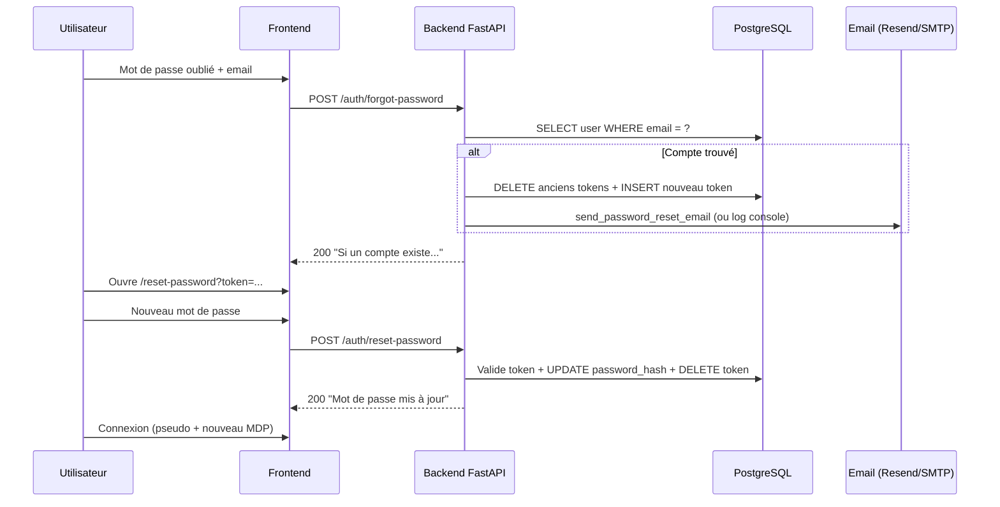

# Mot de passe oublié — Zaap Builder

> **Statut (juillet 2026)** : la fonctionnalité est **implémentée et testable en local**.  
> L’**envoi d’emails réels** (Resend + domaine) est **en pause** — à reprendre plus tard.

---

## Sommaire

1. [Vue d’ensemble](#vue-densemble)
2. [Flux utilisateur](#flux-utilisateur)
3. [Backend](#backend)
4. [Frontend](#frontend)
5. [Base de données](#base-de-données)
6. [Configuration (`.env`)](#configuration-env)
7. [Tester en local (sans email)](#tester-en-local-sans-email)
8. [Envoi d’emails — Resend](#envoi-demails--resend)
9. [Domaine et DNS](#domaine-et-dns)
10. [Production](#production)
11. [Dépannage](#dépannage)
12. [TODO — reprise plus tard](#todo--reprise-plus-tard)

---

## Vue d’ensemble

L’utilisateur peut demander une réinitialisation de mot de passe **via son email** (pas son pseudo).  
Si un compte existe avec cet email :

1. Un **token à usage unique** est créé en base (valide 60 min par défaut).
2. Un **lien** est généré : `{FRONTEND_URL}/reset-password?token=...`
3. Ce lien est soit **envoyé par email** (SMTP configuré), soit **loggé dans la console uvicorn** (SMTP vide — mode dev).

La réponse API est **toujours identique**, qu’un compte existe ou non (anti-énumération).

---

## Flux utilisateur



---

## Backend

### Endpoints

| Méthode | Route | Body | Réponse |
|---------|-------|------|---------|
| `POST` | `/api/v1/auth/forgot-password` | `{ "email": "..." }` | `{ "message": "Si un compte existe..." }` |
| `POST` | `/api/v1/auth/reset-password` | `{ "token": "...", "password": "..." }` | `{ "message": "Mot de passe mis à jour..." }` |

**`forgot-password`**

- Recherche l’utilisateur par **email** (normalisé en minuscules).
- Si trouvé : invalide les anciens tokens du user, génère un token aléatoire (`secrets.token_urlsafe(32)`), stocke le **hash SHA-256** en base, envoie l’email (ou log).
- Toujours HTTP 200 avec le même message.

**`reset-password`**

- Hash le token reçu, cherche en base un token non expiré.
- Met à jour `users.password_hash` (bcrypt), supprime le token (usage unique).
- Erreur 400 : `"Lien invalide ou expiré."` si token absent, expiré ou déjà utilisé.

### Fichiers concernés

| Fichier | Rôle |
|---------|------|
| `backend/app/routers/auth.py` | Endpoints `forgot-password` et `reset-password` |
| `backend/app/models/password_reset_token.py` | Modèle SQLAlchemy |
| `backend/app/services/email.py` | Envoi SMTP + fallback log console |
| `backend/app/config.py` | Variables `FRONTEND_URL`, `PASSWORD_RESET_*`, `SMTP_*` |
| `backend/app/schemas.py` | `ForgotPasswordRequest`, `ResetPasswordRequest`, `MessageResponse` |
| `backend/scripts/add_password_reset_tokens.sql` | Migration SQL |

### Sécurité

- Token brut **jamais stocké** en base — seulement `SHA-256(token)`.
- Token **à usage unique** : supprimé après reset réussi.
- Nouvelle demande de reset → **invalide** les tokens précédents du même user.
- Durée de vie configurable (`PASSWORD_RESET_EXPIRE_MINUTES`, défaut 60 min).
- Mot de passe : min 8 caractères (même règle que l’inscription).

---

## Frontend

### Parcours UI

1. **Navbar → Connexion → « Mot de passe oublié ? »**
2. Saisie de l’**email** → bouton « Envoyer le lien »
3. Message de succès (même texte que l’API)
4. Page **`/reset-password?token=...`** : nouveau mot de passe + confirmation
5. Redirection vers `/stuffs` après succès → connexion avec **pseudo** (pas email)

### Fichiers concernés

| Fichier | Rôle |
|---------|------|
| `frontend/components/layout/AccountButton.tsx` | Mode `forgot` dans le dropdown connexion |
| `frontend/components/auth/ResetPasswordPage.tsx` | Formulaire reset |
| `frontend/app/reset-password/page.tsx` | Route Next.js |
| `frontend/lib/api.ts` | `authForgotPassword()`, `authResetPassword()` |

---

## Base de données

### Table `password_reset_tokens`

```sql
CREATE TABLE IF NOT EXISTS password_reset_tokens (
    id UUID PRIMARY KEY DEFAULT gen_random_uuid(),
    user_id UUID NOT NULL REFERENCES users(id) ON DELETE CASCADE,
    token_hash VARCHAR(64) NOT NULL UNIQUE,
    expires_at TIMESTAMPTZ NOT NULL,
    created_at TIMESTAMPTZ DEFAULT CURRENT_TIMESTAMP
);
```

**Migration** : `backend/scripts/add_password_reset_tokens.sql`

**Statut** : migration déjà exécutée sur la base Supabase du projet (juillet 2026).

Pour rejouer sur une autre base :

```powershell
cd backend
python -c "
import asyncio
from pathlib import Path
from sqlalchemy import text
from app.db.session import engine

raw = Path('scripts/add_password_reset_tokens.sql').read_text(encoding='utf-8')
statements = []
for part in raw.split(';'):
    lines = [ln for ln in part.strip().splitlines() if ln.strip() and not ln.strip().startswith('--')]
    stmt = chr(10).join(lines).strip()
    if stmt:
        statements.append(stmt)

async def run():
    async with engine.begin() as conn:
        for stmt in statements:
            await conn.execute(text(stmt))
    print('Migration OK')

asyncio.run(run())
"
```

---

## Configuration (`.env`)

Fichier racine du projet : `.env` (lu par le backend via `app/config.py`).

### Variables actuelles (dev)

```env
# Liens dans les emails / logs
FRONTEND_URL=http://localhost:3000
PASSWORD_RESET_EXPIRE_MINUTES=60

# SMTP — laisser SMTP_HOST vide en dev
SMTP_HOST=
SMTP_PORT=587
SMTP_USER=
SMTP_PASSWORD=
SMTP_FROM_EMAIL=noreply@zaap-builder.local
SMTP_FROM_NAME=Zaap Builder
SMTP_USE_TLS=true
```

### Comportement selon `SMTP_HOST`

| `SMTP_HOST` | Comportement |
|-------------|--------------|
| **Vide** | Pas d’email. Lien loggé : `SMTP non configuré — lien de réinitialisation pour ...` dans **uvicorn** |
| **Renseigné** | Envoi SMTP réel (ex. Resend) |

> **Important** : redémarrer uvicorn après toute modification du `.env` (`get_settings()` est mis en cache au démarrage).

Référence complète : `.env.example` à la racine.

---

## Tester en local (sans email)

C’est le mode **actuellement utilisé** — pas besoin de domaine ni de Resend.

### Prérequis

- Backend : `uvicorn app.main:app --reload --host 127.0.0.1 --port 8000`
- Frontend : `npm run dev` (port 3000)
- Un compte avec un **email connu** en base

### Étapes

1. Ouvrir l’app → **Connexion** → **Mot de passe oublié ?**
2. Saisir l’**email** du compte (ex. celui utilisé à l’inscription)
3. Cliquer **Envoyer le lien**
4. Dans le **terminal uvicorn**, copier le lien :
   ```
   SMTP non configuré — lien de réinitialisation pour xxx@email.com : http://localhost:3000/reset-password?token=...
   ```
5. Ouvrir ce lien dans le navigateur
6. Choisir un nouveau mot de passe (≥ 8 caractères)
7. Se reconnecter avec le **pseudo** (pas l’email) + nouveau mot de passe

### Points d’attention testés

- **401 au login** = pseudo ou mot de passe incorrect (normal si mauvais identifiants).
- **200 au forgot-password** = requête OK ; le mail part seulement si SMTP configuré.
- **Double clic « Envoyer le lien »** → seul le **dernier** token est valide.
- La connexion utilise le **username**, pas l’email.

---

## Envoi d’emails — Resend

Provider choisi pour la prod : **[Resend](https://resend.com)** (gratuit ~100 mails/jour).

### Étape 1 — Compte et clé API

1. Créer un compte sur [resend.com](https://resend.com)
2. Dashboard → **API Keys** → **Create API Key**
3. Copier la clé `re_...` → la mettre **uniquement** dans `.env` (`SMTP_PASSWORD`)
4. **Ne jamais** commiter la clé ni la poster dans un chat — révoquer et recréer si exposée

### Étape 2 — Credentials SMTP Resend

| Variable | Valeur Resend |
|----------|---------------|
| `SMTP_HOST` | `smtp.resend.com` |
| `SMTP_PORT` | `587` (STARTTLS) ou `465` (SSL) |
| `SMTP_USER` | `resend` |
| `SMTP_PASSWORD` | clé API `re_...` |
| `SMTP_USE_TLS` | `true` pour port 587, `false` pour port 465 |

### Étape 3 — Adresse d’expéditeur (`SMTP_FROM_EMAIL`)

Ce n’est **pas** une vraie boîte mail à créer. C’est l’identité affichée dans le mail :

```env
SMTP_FROM_EMAIL=noreply@ton-domaine.fr
SMTP_FROM_NAME=Zaap Builder
```

Résultat côté utilisateur : `Zaap Builder <noreply@ton-domaine.fr>`

### Option A — Test sans domaine (limité)

```env
SMTP_FROM_EMAIL=onboarding@resend.dev
```

**Limitation** : Resend n’envoie en mode test qu’à l’**email du compte Resend** (inscription).  
Pas adapté pour envoyer à tous les utilisateurs (Hotmail, etc.).

### Option B — Prod (recommandé)

Domaine vérifié sur Resend → `noreply@zaap-builder.fr` (ou autre `@ton-domaine`).

### Exemple `.env` complet avec Resend (prod)

```env
FRONTEND_URL=https://zaap-builder.vercel.app
PASSWORD_RESET_EXPIRE_MINUTES=60

SMTP_HOST=smtp.resend.com
SMTP_PORT=587
SMTP_USER=resend
SMTP_PASSWORD=re_xxxxxxxx
SMTP_FROM_EMAIL=noreply@zaap-builder.fr
SMTP_FROM_NAME=Zaap Builder
SMTP_USE_TLS=true
```

Alternative port 465 :

```env
SMTP_PORT=465
SMTP_USE_TLS=false
```

---

## Domaine et DNS

### Pourquoi un domaine ?

Sans domaine **possédé et vérifié**, Resend **ne peut pas** envoyer depuis `@zaap-builder.fr` (ou tout autre domaine).  
La vérification DNS prouve que tu contrôles le domaine.

> **Situation actuelle (juillet 2026)** : tentative d’ajout de `zaap-builder.fr` sur Resend **sans avoir acheté le domaine** — la vérification ne pourra pas aboutir tant qu’on ne possède pas le nom de domaine.

### Acheter un domaine

Registrars courants :

| Fournisseur | Prix indicatif | URL |
|-------------|----------------|-----|
| OVH | `.fr` ~5–8 €/an | https://www.ovh.com/fr/domaines/ |
| Gandi | `.fr` ~10 €/an | https://www.gandi.net/fr |
| Cloudflare | `.com` ~10 €/an | https://www.cloudflare.com/products/registrar/ |
| Namecheap | `.com` ~10–12 €/an | https://www.namecheap.com |

**À refuser à l’achat** (inutile pour Zaap Builder) :

- Hébergement web (le front est sur Vercel)
- Boîte mail payante (Resend envoie, pas besoin d’inbox)
- SSL payant (Vercel fournit HTTPS)

Extensions conseillées : `.fr` ou `.com` (ex. `zaapbuilder.fr`, `zaap-builder.com`).

### Configurer le domaine sur Resend

1. Resend → **Domains** → **Add Domain**
2. Saisir le domaine acheté (ex. `zaap-builder.fr`)
3. Région : North Virginia (défaut) — OK
4. **Enable Receiving** : laisser **OFF** (on n’a besoin que d’envoyer)
5. **Click tracking** : optionnel (décocher pour des liens directs dans le mail de reset)
6. Cliquer **Add Domain**

### Enregistrements DNS à ajouter

Copier depuis Resend → les coller dans la **zone DNS** du registrar (OVH, Gandi, etc.).

**Domain Verification (DKIM)** — obligatoire

| Type | Nom / Host | Valeur |
|------|------------|--------|
| TXT | `resend._domainkey` | longue chaîne `p=MIGfMA0GCS...` (copiée depuis Resend) |

**Enable Sending (SPF & MX)** — obligatoire pour envoyer

| Type | Nom / Host | Valeur | Priorité |
|------|------------|--------|----------|
| MX | `send` | `feedback-smtp.us-east-1.amazonses.com` (valeur exacte Resend) | 10 |
| TXT | `send` | `v=spf1 include:amazonses.com ~all` (valeur exacte Resend) | — |

**DMARC (optionnel mais recommandé)**

| Type | Nom / Host | Valeur |
|------|------------|--------|
| TXT | `_dmarc` | `v=DMARC1; p=none;` |

**Note hébergeurs** : certains panels veulent `send` seul, d’autres `send.zaap-builder.fr` — suivre le format des autres enregistrements existants dans la zone.

### Après ajout DNS

1. Attendre propagation (5 min à 48 h)
2. Resend → **I've added the records**
3. Statut **Pending** → **Verified**
4. Mettre à jour `.env` avec `SMTP_FROM_EMAIL=noreply@ton-domaine.fr`
5. Redémarrer le backend

### Architecture domaine (vue globale)

```
Domaine (OVH / Gandi / …)
    ├── DNS → Resend     (envoi emails : DKIM, SPF, MX)
    ├── DNS → Vercel     (site : CNAME vers vercel.app) — optionnel
    └── .env backend     (SMTP_FROM_EMAIL, FRONTEND_URL)
```

Le sous-domaine Vercel (`*.vercel.app`) **ne sert pas** d’adresse email — il faut un domaine à soi.

---

## Production

### Checklist

- [ ] Domaine acheté et vérifié sur Resend
- [ ] Variables SMTP dans l’hébergement backend (Render, Railway, etc.)
- [ ] `FRONTEND_URL` = URL publique du front (ex. `https://zaap-builder.vercel.app`)
- [ ] `JWT_SECRET` fort et unique
- [ ] Clé API Resend en variable secrète (pas dans git)
- [ ] Migration `password_reset_tokens` appliquée sur la DB prod
- [ ] Test end-to-end : forgot → email reçu → reset → login

### Variables backend prod (exemple)

```env
FRONTEND_URL=https://zaap-builder.vercel.app
PASSWORD_RESET_EXPIRE_MINUTES=60
SMTP_HOST=smtp.resend.com
SMTP_PORT=587
SMTP_USER=resend
SMTP_PASSWORD=re_...
SMTP_FROM_EMAIL=noreply@zaap-builder.fr
SMTP_FROM_NAME=Zaap Builder
SMTP_USE_TLS=true
```

Vérifier les env vars aussi côté **plateforme de déploiement** du backend (pas seulement le `.env` local).

---

## Dépannage

| Symptôme | Cause probable | Action |
|----------|----------------|--------|
| Pas de mail reçu | `SMTP_HOST` vide | Normal en dev — lire les logs uvicorn |
| Toujours le lien dans les logs | SMTP non configuré ou backend pas redémarré | Remplir SMTP + redémarrer uvicorn |
| `401` au login | Mauvais pseudo/MDP | Connexion = **username**, pas email |
| `200` forgot mais rien en log | Email inconnu en base | Vérifier `SELECT email FROM users WHERE ...` |
| « Lien invalide ou expiré » | Token expiré, déjà utilisé, ou ancien token | Redemander un **nouveau** lien (dernier seul valide) |
| Double demande reset | Normal | Seul le **dernier** token est actif |
| Erreur SMTP | Mauvaise clé, port/TLS incorrect | Port 587 + `SMTP_USE_TLS=true` ou 465 + `false` |
| Resend refuse l’envoi | Domaine non Verified | Finir config DNS |
| Mail en spam | Domaine récent, pas de DMARC | Ajouter DMARC, attendre réputation |
| `onboarding@resend.dev` ne marche pas vers Hotmail | Limitation mode test Resend | Vérifier un vrai domaine |

### Où voir les logs

- **Dev sans SMTP** : terminal **uvicorn** (pas Next.js)
- **Avec Resend** : dashboard Resend → **Emails** / **Logs**

---

## TODO — reprise plus tard

- [ ] **Acheter un domaine** (ex. `zaapbuilder.fr` ou variante disponible)
- [ ] **Vérifier le domaine sur Resend** (DNS DKIM + SPF + MX)
- [ ] **Configurer SMTP** dans `.env` local puis variables prod
- [ ] **Révoquer/recréer** la clé API Resend si elle a été exposée
- [ ] **Tester** envoi réel vers Hotmail/Gmail
- [ ] **Optionnel** : lier le domaine au front Vercel (URL custom)
- [ ] **Optionnel** : désactiver click tracking Resend pour les mails de reset

---

## Références rapides

- Doc Resend SMTP : https://resend.com/docs/send-with-smtp
- Migration SQL : `backend/scripts/add_password_reset_tokens.sql`
- Exemple env : `.env.example`
- Route reset front : `/reset-password?token=...`
